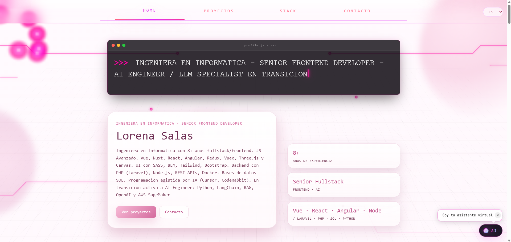
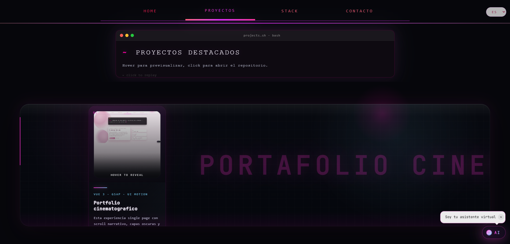
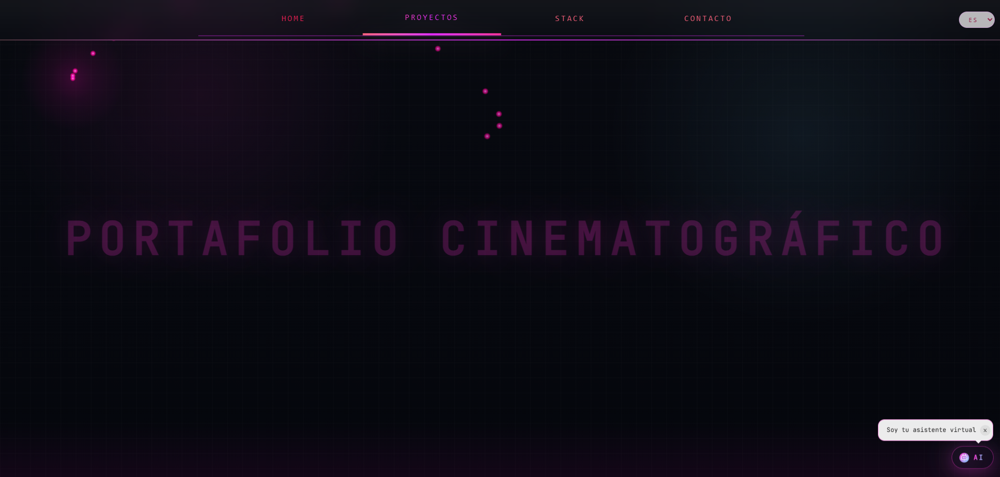
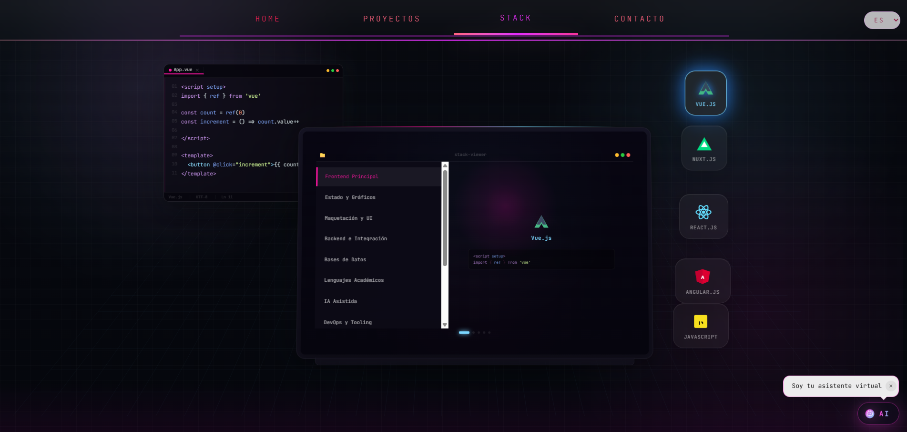
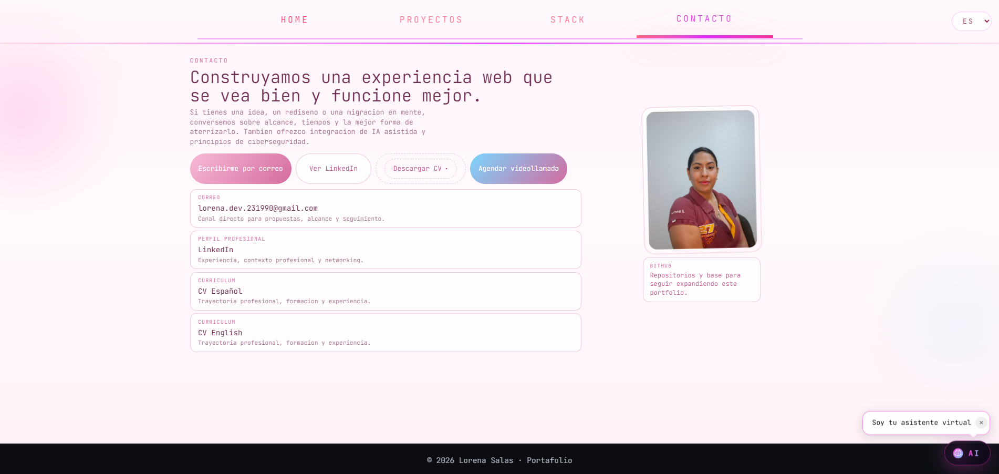

# 🚀 Full Stack Developer | AI Engineering Aspirant

¡Hola! Soy Lorena Salas, desarrolladora **Full Stack** con experiencia en la creación de aplicaciones web escalables y eficientes. Mi enfoque actual combina el desarrollo de arquitecturas completas (End-to-End) con la integración de soluciones de **Inteligencia Artificial**.

Este es mi portfolio profesional desarrollado como una Single Page Application (SPA). El objetivo de este proyecto es demostrar el dominio de frameworks frontend, diseño responsivo y la implementación de sistemas multilingües.

## 🛠️ Stack Tecnológico
*   **Framework:** Vue 3 (Composition API + `<script setup>`)
*   **Herramienta de Construcción:** Vite
*   **Estilos:** Tailwind CSS
*   **Internacionalización:** Vue-i18n (Soporte multilingüe ES/EN)
*   **Arquitectura:** Gestión de contenido mediante JSON dinámico.

## ✨ Características Técnicas
- **i18n Dinámico:** Cambio de idioma en tiempo real sin recarga.
- **Lead Generation Bot (En desarrollo):** Chatbot integrado para canalización de clientes potenciales hacia WhatsApp/Email.
- **Responsive UI:** Diseño optimizado para máxima fidelidad en cualquier dispositivo

## ✨ Estándares de Desarrollo
- **Clean Architecture:** Código modular, mantenible y orientado a componentes.
- **CI/CD:** Automatización de despliegues y control de versiones profesional.
- **Internacionalización:** Preparado para mercados globales con soporte nativo de idiomas.
- **Seguridad:** Manejo responsable de variables de entorno y protección de datos.

## 📸 Screenshots

<table>
  <tr>
    <td></td>
    <td></td>
  </tr>
  <tr>
    <td></td>
    <td></td>
  </tr>
  <tr>
    <td></td>
    <td></td>
  </tr>
</table>

## 🚀 Instalación Local

```bash
# Clonar el repositorio
git clone https://github.com

# Instalar dependencias
npm install

# Iniciar servidor de desarrollo
npm run serve
```

---
📫 **¿Conectamos?**  
https://www.linkedin.com/in/lorenaesalasm/ | lesm231990@gmail.com
